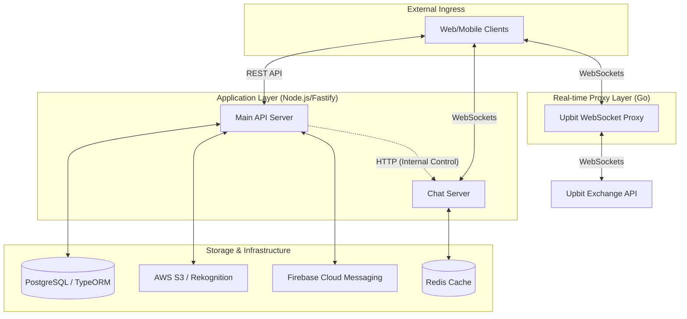

# Coinsect API & Chat Server 🚀

> **실시간 가상자산 정보 플랫폼 [Coinsect.io](https://coinsect.io)의 백엔드 시스템입니다.**

본 레포지토리는 Coinsect 서비스의 API 서버와 실시간 채팅 엔진, 그리고 거래소 시세 중계 프록시를 포함하고 있습니다. 실제 운영 환경에서 축적된 실시간 데이터 처리 로직과 서비스 분리 구조를 포함하고 있습니다.

---

## 🏗️ Architecture: Service Separation

운영 안정성을 위해 **API 서버와 채팅 서버를 독립적으로 실행**할 수 있도록 설계되었습니다.

### 1. 서비스 간 물리적 분리 (Decoupling)
- **독립적 프로세스 운영**: WebSocket 연결을 유지하는 채팅 서버와 REST API를 처리하는 서버를 분리하여 운영할 수 있습니다.
- **엔드포인트 설정**: 환경 변수(`COINSECT_CHAT`)를 통해 두 서버의 엔드포인트를 지정하여 네트워크상에서 분리된 상태로 상호작용합니다.

### 2. 내부 HTTP API 기반 제어 (Internal Control Plane)
API 서버가 채팅 서버의 상태를 변경하거나 명령을 내릴 때 직접적인 코드 호출 대신 **HTTP 프로토콜**을 사용합니다.
- **API Server**: `services/chat.ts`에서 `axios`를 사용하여 채팅 서버에 전체 공지(broadcast), 특정 메시지 전송, 사용자 차단 등을 요청합니다.
- **Chat Server**: `chat/routes.ts`에서 `/webchat` 경로로 정의된 내부 관리용 엔드포인트를 통해 API 서버의 요청을 수신합니다.

---

## ⚡ Data Pipeline: Upbit WebSocket Proxy

거래소(Upbit)의 고빈도 시세 데이터를 효율적으로 중계하기 위해 **Go(Golang) 기반의 프록시**를 사용합니다.

### 1. Single Connection Multiplexing (단일 인스턴스 기준)
- **커넥션 집약**: 거래소와 단 하나의 WebSocket 연결을 유지하며, 접속한 모든 클라이언트에게 데이터를 중계합니다. (`proxy_upbit/main.go`)
- **구독 취합 (Subscription Merging)**: 모든 클라이언트가 요청한 구독 시장 정보를 실시간으로 취합하여 거래소에 전송함으로써 불필요한 패킷을 최소화합니다.

### 2. Throttling & Batching
- **데이터 흐름 제어**: 초당 다수의 시세 데이터를 일정 주기(기본 1000ms)로 버퍼링한 후 최신 데이터를 배칭(Batching)하여 전송합니다. 이를 통해 클라이언트 측의 렌더링 부하를 조절합니다.
- **동시성 제어**: Go의 `sync.Mutex` 및 `sync.RWMutex`를 사용하여 다수의 고루틴 환경에서 데이터 접근을 관리합니다.

---

## 🏗 System Architecture

---

## 🔍 Implementation Details

### 🛡️ 모더레이션 및 보안 로직
- **Image Moderation**: AWS Rekognition을 연동하여 업로드된 이미지의 시각적 부적절성을 실시간으로 확인합니다.
- **Rate Limiting**: 채팅 메시지 전송 빈도를 IP 기반으로 제한하여 스팸을 방지합니다.
- **Slack Alert**: 시스템 이상 징후나 모더레이션 이벤트 발생 시 지정된 채널로 실시간 알림을 발송합니다.

### 🚀 서버 기동 최적화
- **Parallel Bootstrapping**: 서버 시작 시 금칙어 로딩, 차단 사용자 확인 등 DB 의존적인 초기화 작업을 병렬로 처리합니다. (`server_modules.ts`)

---

## 🛠 Tech Stack

- **Backend**: Node.js, TypeScript, Fastify, Go
- **Database**: PostgreSQL, TypeORM, Redis
- **Cloud**: AWS (S3, Rekognition), Firebase (FCM)
- **AI**: Google Generative AI (Gemini)

---

## 🚀 Setup

1. **Environment**: `.env.sample`을 바탕으로 `.env` 구성
2. **Dependencies**: `npm install`
3. **Database**: `psql -U coinsect -d coinsect -f schema/001_baseline.sql`
   (스키마의 단일 출처는 `schema/001_baseline.sql`이다. TypeORM 마이그레이션은 폐기했다 -
   이후 변경은 `schema/002_*.sql`로 붙인다. 자세한 건 `schema/README.md` 참고)
4. **Run**: `npm run dev`
5. **Proxy**: `cd proxy_upbit && go run main.go`

---
© 2018 - 2026 Coinsect. All rights reserved.